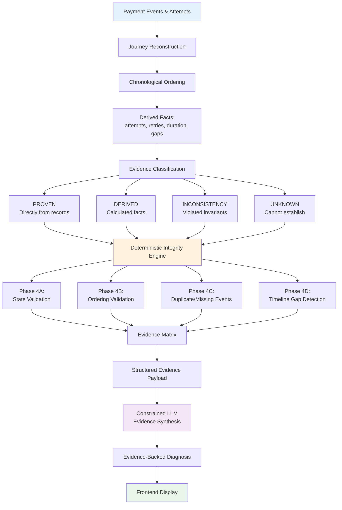
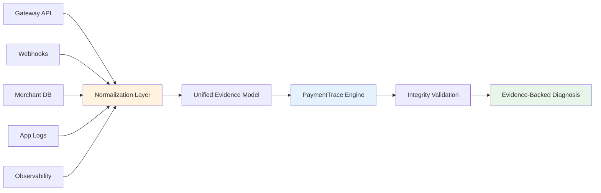

<div align="center">
  
  
  # PaymentTrace
  
  ### Evidence-backed payment forensics
  
  **Reconstruct the journey. Trace the evidence. Explain what actually happened.**
  
  [](tests/)
  [](https://www.python.org/)
  [](https://fastapi.tiangolo.com/)
  [](https://ai.google.dev/)
  
</div>

---

## 👨‍💻 Project Author

<div align="center">

**Adhimulam Bhargav Sai Viswanath**


B.Tech — Computer Science and Engineering (AI & ML)  
Vasireddy Venkatadri Institute of Technology (VVIT)  
Batch: 2023–2027

AI Engineer Intern @ Paytm

</div>

PaymentTrace is an **independently developed student buildathon project** exploring evidence-backed payment journey reconstruction and deterministic diagnostic reasoning. This project is not officially sponsored, endorsed, or deployed by VVIT or Paytm.

---

## The Problem: Fragmented Payment Debugging

### Real-World Scenario: The D-Mart UPI Purchase

Consider this illustrative example:

> A customer at D-Mart purchases ₹3,000 worth of groceries using a UPI QR code. The payment journey involves multiple systems:
> 
> **Customer App** → **Merchant POS** → **Payment Gateway** → **Bank** → **Webhooks** → **Merchant Database**

**What can go wrong:**

```
15:30:00  Customer scans UPI QR code
15:30:02  Merchant creates order (order_12345, ₹3,000)
15:30:03  Payment attempt 1 initiated (payment_001)
15:30:05  Customer enters wrong UPI PIN → Payment fails
15:30:15  Customer retries payment (payment_002)
15:30:18  Payment authorized by bank
15:30:20  Payment captured
15:30:22  Webhook #1 arrives: "payment.authorized"
15:30:45  Webhook #2 arrives: "payment.captured" (delayed)
15:31:00  Merchant checks: Order shows "created" (webhook not processed yet)
15:31:30  Webhook processor runs
15:31:32  Order updated to "paid"
```

**Investigation Challenges:**

When the customer complains "I paid but my order isn't confirmed," the merchant support team needs to:

1. **Correlate scattered records** — Gateway logs, webhook delivery records, merchant database, application logs
2. **Reconstruct timeline** — Which payment attempt succeeded? When did events actually happen?
3. **Identify inconsistencies** — Why does the gateway show "captured" but merchant database shows "created"?
4. **Detect anomalies** — Was the webhook delayed? Did events arrive out of order? Are there duplicate events?
5. **Determine unknowns** — Is data missing? What can't be proven from available evidence?

**Current debugging approach:**
- ❌ Manual log correlation across systems
- ❌ Ad-hoc SQL queries
- ❌ Guesswork about timing and causality
- ❌ Inconsistent diagnostic quality
- ❌ Time-consuming investigation (15-30 minutes per incident)

**PaymentTrace approach:**
- ✅ Automated journey reconstruction
- ✅ Systematic evidence classification
- ✅ Deterministic integrity validation
- ✅ Evidence-backed natural language diagnosis
- ✅ Explicit handling of unknowns

**Important Note:** The D-Mart example above is an illustrative scenario demonstrating the general problem PaymentTrace addresses. The current prototype uses developer-created controlled scenarios (detailed below), not actual D-Mart or production customer transactions.

---

## What PaymentTrace Does

PaymentTrace is a **payment forensics tool** for investigating individual payment journeys. It:

### Core Capabilities

1. **Journey Reconstruction**
   - Chronologically orders events, attempts, and state changes
   - Groups retries by order
   - Calculates derived facts (attempt count, retry count, duration, gaps)

2. **Evidence Classification**
   - **PROVEN:** Directly from database records
   - **DERIVED:** Calculated deterministically
   - **INCONSISTENCY:** Violated invariants detected by rules
   - **UNKNOWN:** Cannot be established from available data

3. **Integrity Validation**
   - **Phase 4A:** State machine transition validation
   - **Phase 4B:** Timestamp ordering validation
   - **Phase 4C:** Duplicate/missing event detection
   - **Phase 4D:** Timeline gap detection (conservative thresholds)

4. **Constrained LLM Synthesis**
   - Converts structured evidence into natural language
   - 13 anti-hallucination constraints
   - Evidence-grounded explanations only

5. **Uncertainty Preservation**
   - Explicitly marks what cannot be determined
   - **UNKNOWN ≠ FAILURE**
   - **INCONSISTENCY ≠ ROOT CAUSE**

### What PaymentTrace Is NOT

- ❌ A replacement for payment dashboards (Razorpay Dashboard, etc.)
- ❌ A real-time payment monitoring system
- ❌ A guaranteed root cause detection system
- ❌ A production payment processing platform
- ❌ A financial reconciliation system

### What PaymentTrace IS

- ✅ A forensic investigation tool for post-incident analysis
- ✅ An evidence classification system
- ✅ A demonstration of deterministic + LLM architecture
- ✅ A prototype for evidence-backed diagnostic reasoning
- ✅ An independent student buildathon project

---

## System Architecture



**Architectural Principle:** The deterministic engine is the source of truth. The LLM is a natural language synthesis layer only.

---

## Evidence Model

PaymentTrace classifies every fact into exactly **one of four categories:**

| Category | Definition | Source | Example |
|----------|-----------|--------|---------|
| **🟢 PROVEN** | Directly supported by database records | `payment_events`, `payment_attempts`, `orders` tables | "Event 'payment.captured' occurred at 2026-09-05T15:00:10Z" |
| **🔵 DERIVED** | Deterministically calculated from records | Timestamp arithmetic, counting, duration calculations | "Journey duration: 54.2 seconds", "Total attempts: 2" |
| **🔴 INCONSISTENCY** | A contradiction or violated invariant | Deterministic integrity rules (Phase 4A/B/C) | "Payment captured without prior authorization event" |
| **🟡 UNKNOWN** | Cannot be established from available evidence | Missing data detection, Phase 4D timing anomalies | "No payment.initiated event found when authorized exists" |

### Critical Principles

**UNKNOWN ≠ FAILURE**  
An unknown fact or timing anomaly does not prove payment failure. It indicates missing information or unusual patterns.

**INCONSISTENCY ≠ ROOT CAUSE**  
An inconsistency reveals a violated invariant but doesn't by itself prove the underlying cause (e.g., network failure, bank rejection).

**DERIVED ≠ PROVEN**  
Calculated facts are deterministic but depend on timestamp accuracy and data completeness.

**LLM ≠ SOURCE OF TRUTH**  
The LLM converts structured evidence into natural language. It does not determine facts, calculate metrics, or classify evidence.

---

## Deterministic Integrity Engine

PaymentTrace implements **four phases of automated integrity analysis:**

### Phase 4A: State Machine Validation

**Detects:** Invalid payment lifecycle transitions

**Rules:**
- ❌ Payment captured without prior authorization
- ❌ Terminal state regression (captured → initiated)
- ❌ Logically impossible state progressions

**Classification:** `INCONSISTENCY`

**Example:** Scenario C detects `payment.captured` without `payment.authorized`

---

### Phase 4B: Timestamp Ordering Validation

**Detects:** Logical timestamp violations

**Rules:**
- ❌ `authorized` timestamp < `initiated` timestamp
- ❌ `captured` timestamp < `authorized` timestamp
- ❌ Any chronologically impossible event sequence

**Classification:** `INCONSISTENCY`

**Example:** Scenario E detects `authorized` event at 15:00:00 when `initiated` occurred at 15:00:10

---

### Phase 4C: Duplicate & Missing Event Detection

**Duplicates:**
- Detects repeated lifecycle events (e.g., two `payment.captured` for same `payment_id`)
- Ignores `webhook.received` (webhooks can legitimately retry)
- **Classification:** `INCONSISTENCY`

**Missing Events:**
- Conservatively identifies absent but expected events
- Does **not** claim event never occurred, only that it's not in available records
- **Classification:** `UNKNOWN`

**Examples:**
- Scenario F: Duplicate `payment.captured` detected → `INCONSISTENCY`
- Scenario G: Missing `payment.initiated` when `authorized` exists → `UNKNOWN`

---

### Phase 4D: Timeline Gap Detection

**Detects:** Unusual timing patterns using conservative thresholds

**Thresholds (from `backend/services/integrity.py`):**

| Transition | Threshold | Classification |
|-----------|-----------|----------------|
| `initiated → authorized` | > 90 seconds | `UNKNOWN` |
| `authorized → captured` | > 45 seconds | `UNKNOWN` |
| Consecutive lifecycle gap | < 50 milliseconds | `UNKNOWN` |

**Important:**
- Timing anomalies are flagged as `UNKNOWN`, not `INCONSISTENCY`
- Long gaps **do not prove failure** (legitimate authorization delays exist)
- Near-zero gaps may indicate timestamp precision issues
- Thresholds are prototype heuristics requiring domain validation

**Examples:**
- Scenario B: 45s gap (below 90s threshold) → **No Phase 4D detection** ✓
- Scenario H: 120s gap (above 90s threshold) → `UNKNOWN` detection
- Scenario I: 20ms gaps → `UNKNOWN` detection

**Design Rationale:** The 90-second threshold was chosen to avoid flagging Scenario B's legitimate 45-second authorization delay as an anomaly.

---

## Where AI Is Used (LLM Boundary)

### What the Deterministic Engine Does

✅ Orders events chronologically by timestamp  
✅ Calculates attempt count, retry count, journey duration  
✅ Validates state machine transitions  
✅ Detects out-of-order timestamps  
✅ Identifies duplicate/missing events  
✅ Flags timeline anomalies  
✅ Classifies all evidence (PROVEN/DERIVED/INCONSISTENCY/UNKNOWN)

### What the LLM Does

✅ Converts structured evidence into natural language  
✅ Synthesizes technical narrative from facts  
✅ Generates evidence-backed explanations

### What the LLM Must NOT Do

❌ Query the database  
❌ Determine payment facts or journey state  
❌ Calculate retry counts or durations  
❌ Classify evidence categories  
❌ Invent facts not present in evidence  
❌ Infer root causes without supporting evidence  
❌ Convert UNKNOWN into PROVEN  
❌ Convert DERIVED into PROVEN  
❌ Claim payment failed if later evidence shows success  
❌ Speculate beyond available evidence

**Architecture:** Evidence-Backed Natural Language Generation

**LLM Provider:** Google Gemini (`gemini-3.7-flash`)  
**Constraints:** 13 anti-hallucination rules enforced through system prompts  
**Response Format:** Structured JSON with Pydantic validation

**Design Principle:**  
"Deterministic code decides what the system knows; the LLM decides how that evidence is communicated."

---

## Current Prototype Data

### ⚠️ Important Data Disclosure

The current PaymentTrace prototype uses **developer-created, controlled synthetic payment scenarios** for deterministic testing and demonstration.

**What the data is:**
- ✅ Manually constructed payment lifecycle patterns
- ✅ Controlled fixtures with known ground truth
- ✅ Intentionally designed to reproduce specific anomaly types
- ✅ Developer-created test scenarios (created by project author)

**What the data is NOT:**
- ❌ Real customer payment records
- ❌ Production payment gateway traces
- ❌ Actual D-Mart, Razorpay, or Paytm merchant transactions
- ❌ Sanitized production data
- ❌ Real incident recordings

**Disclaimer:** All demonstration scenarios are developer-created controlled test data. No real customer payment information is used. No production database access exists.

**Why synthetic data?**
1. Real customer payment data contains sensitive PII and financial information
2. Controlled scenarios enable deterministic testing with known ground truth
3. Specific anomaly types can be intentionally constructed for validation
4. Reproduction is deterministic and testable
5. Ethical constraints prevent student projects from accessing production payment data

**Data Location:** `backend/fixtures/data.py` and `backend/fixtures/advanced_scenarios.py`

---

## Demo Scenarios

PaymentTrace includes **8 developer-created controlled scenarios** demonstrating different payment lifecycle patterns:

| ID | Description | Problem | Phase | Detection | Purpose |
|----|-------------|---------|-------|-----------|---------|
| **A** | UPI Retry Recovery | Normal retry flow | - | No anomalies | Baseline: normal multi-attempt journey |
| **B** | Late Authorization | 45s initiated→authorized gap | - | No Phase 4D flag (below 90s) | Verify threshold calibration |
| **C** | Invalid State Transition | Captured without authorized | 4A | `INCONSISTENCY` | State machine violation |
| **E** | Out-of-Order Events | Authorized timestamp < initiated | 4B | `INCONSISTENCY` | Timestamp ordering violation |
| **F** | Duplicate Lifecycle Event | Two `payment.captured` events | 4C | `INCONSISTENCY` | Duplicate detection |
| **G** | Missing Expected Event | No `initiated` when `authorized` exists | 4C | `UNKNOWN` | Missing event handling |
| **H** | Long Authorization Gap | 120s initiated→authorized gap | 4D | `UNKNOWN` | Long gap detection |
| **I** | Near-Zero Timing | 20ms consecutive lifecycle gaps | 4D | `UNKNOWN` | Fast timing anomaly |

**Key Design Verification:**
- Scenario B (45s gap) correctly does **not** trigger Phase 4D because 45 < 90-second threshold
- This confirms the system does not generate false positives for legitimate authorization delays

**Access:** These scenarios are available through the API as `order_scenario_a`, `order_scenario_b`, etc.

---

## From Prototype to Future Real-World Integration

The current implementation establishes the deterministic forensic engine using controlled data. Future integration could connect PaymentTrace to operational payment infrastructure:

### Current Architecture (Prototype)

```
Developer-Created Database
         ↓
Controlled Scenarios
         ↓
PaymentTrace Engine
```

### Proposed Future Architecture



**Proposed Future Data Sources:**
- Payment gateway APIs (test mode initially, then production with authorization)
- Webhook delivery logs
- Merchant order databases
- Application logs
- Observability platforms (Datadog, Sentry)

**Integration Requirements:**
- Privacy-compliant data handling
- Secure credential management
- Rate limiting and backpressure
- Authentication and authorization
- Audit logging
- Data retention policies
- Cross-gateway schema normalization

**Benefits:**
- Real operational usefulness for production incident investigation
- Larger trace volume and pattern diversity
- Automatic ingestion from live systems
- Merchant-specific diagnostic rules
- Continuous integrity monitoring
- Historical anomaly analysis

**Status:** 🔮 **FUTURE WORK** (not currently implemented)

**Important:** Real-world integration would require compliance with data protection regulations, security audits, and proper authorization from payment system operators.

---

## Technical Stack

- **Backend:** FastAPI (Python 3.9+)
- **Database:** SQLite with `aiosqlite` (developer-created fixtures)
- **Frontend:** Vanilla HTML/CSS/JavaScript (no frameworks)
- **LLM:** Google Gemini (`gemini-3.7-flash`) via `google-genai` SDK
- **Testing:** `pytest` with `pytest-asyncio`, `httpx`
- **Configuration:** `python-dotenv` for environment variables

---

## Running Locally

### Prerequisites

- Python 3.9+
- pip
- (Optional) Google Gemini API key for diagnosis endpoint

### Installation

```bash
# 1. Clone repository
git clone <repository-url>
cd PaymentTrace

# 2. Create virtual environment
python3 -m venv venv
source venv/bin/activate  # On Windows: venv\Scripts\activate

# 3. Install dependencies
pip install -r requirements.txt

# 4. Configure Gemini API (Optional)
cp .env.example .env
# Edit .env and add: GEMINI_API_KEY=your_actual_api_key_here

# 5. Run backend
python -m uvicorn backend.main:app --reload

# 6. Open frontend
open frontend/index.html  # macOS
# or navigate to: file:///path/to/PaymentTrace/frontend/index.html
```

**Backend:** http://localhost:8000  
**API Docs:** http://localhost:8000/docs  
**Health Check:** http://localhost:8000/health

**Note:** Without a Gemini API key, Phase 1 endpoints (`/journeys/{order_id}`) work normally. Phase 2 diagnosis endpoint returns 503 error. All 76 tests still pass (tests use mocked LLM responses).

---

## API Endpoints

### Phase 1: Deterministic Reconstruction (No LLM Required)

**`GET /journeys/{order_id}`**  
Deterministic payment journey reconstruction

**Returns:**
- Order details
- Chronologically ordered events
- Payment attempts
- Derived facts
- Evidence classification (PROVEN/DERIVED/INCONSISTENCY/UNKNOWN)

**Example:**
```bash
curl http://localhost:8000/journeys/order_scenario_a
```

### Phase 2: Evidence-Backed Diagnosis (Requires Gemini API Key)

**`GET /journeys/{order_id}/diagnosis`**  
Complete diagnostic report with AI-generated explanation

**Example:**
```bash
curl http://localhost:8000/journeys/order_scenario_h/diagnosis
```

---

## Testing

```bash
pytest -v
```

**Current status: ✅ 76/76 tests passing**

**Test breakdown:**
- 10 tests: Phase 1 reconstruction logic
- 8 tests: Phase 1 API endpoints
- 8 tests: Phase 2 LLM service (mocked)
- 8 tests: Phase 2 diagnosis endpoint (mocked)
- 42 tests: Phase 4A/B/C/D integrity analysis

**Important:** All tests use mocked Gemini responses. Tests do **NOT** require a real `GEMINI_API_KEY` and will not make external API calls.

**What Tests Verify:**
- ✅ Event chronological ordering
- ✅ Attempt/retry counting
- ✅ Duration calculations
- ✅ State machine validation (Phase 4A)
- ✅ Out-of-order detection (Phase 4B)
- ✅ Duplicate/missing event detection (Phase 4C)
- ✅ Timeline gap detection (Phase 4D)
- ✅ Evidence classification
- ✅ API contract validation
- ✅ Error handling

**What Tests Do NOT Verify:**
- ❌ Production payment gateway behavior
- ❌ Real Gemini API responses
- ❌ Real-world incident detection accuracy
- ❌ Human evaluation of diagnostic usefulness
- ❌ Large-scale performance

---

## Current Limitations

### Prototype Scope

1. **Data Source:** Database is entirely developer-created synthetic data
2. **No Production Integration:** No real payment gateway or database connections
3. **Limited Coverage:** Deterministic rules cover a defined set of lifecycle anomalies
4. **Heuristic Thresholds:** Phase 4D thresholds (90s, 45s, 50ms) require domain validation
5. **Generic Payment Flow:** Payment-method-specific rules not implemented
6. **Single Journey Analysis:** Does not perform population-level pattern analysis
7. **Prototype Scale:** Not designed for high-volume production workloads
8. **Missing Production Features:** No authentication, authorization, audit logging, observability

### Technical Constraints

9. **Causality Limitations:** Cannot prove causes absent from telemetry (e.g., bank network failures)
10. **LLM Dependency:** Diagnosis quality depends on Gemini model behavior
11. **Timestamp Precision:** Relies on accurate timestamp recording
12. **Gateway Schema Variance:** Real payment gateways have provider-specific event schemas
13. **No Reconciliation Authority:** Should not be used as financial reconciliation system

### Evaluation Status

14. **No Human Evaluation:** Diagnostic usefulness not formally evaluated with payment operations engineers
15. **No Baseline Comparison:** System not experimentally compared against alternative approaches
16. **No Statistical Validation:** Precision/recall not measured on real incident dataset
17. **No Large-Scale Testing:** Performance not validated on high-volume trace datasets

**Important:** These are current boundaries of the prototype, not system failures. They represent future work opportunities.

---

## Future Work

### Near Term
- Payment gateway test-mode integration
- Webhook log ingestion
- Expanded synthetic scenario library
- Real Gemini API testing with production key
- Frontend responsive design testing
- Performance profiling

### Medium Term
- Payment-method-specific rules (UPI, card, netbanking, wallet)
- Merchant-specific lifecycle policies
- Multi-order incident clustering
- Historical anomaly retrieval
- Developer remediation suggestions
- Adaptive threshold tuning based on gateway behavior

### Long Term
- Production observability integrations (Datadog, Sentry)
- Real-time forensic monitoring
- Cross-merchant pattern analysis
- Automated incident triage
- Enterprise access controls
- Human evaluation study with payment operations engineers
- Experimental validation against baseline approaches
- Causal inference under uncertainty

---

## Technical Documentation

For detailed system architecture, evaluation methodology, experimental design, and future research directions:

**📄 [Read the PaymentTrace Technical Architecture & Evaluation Document →](docs/PAYMENTTRACE_TECHNICAL_PAPER.md)**

This document uses a technical paper-style structure to describe:
- Detailed system architecture
- Experimental methodology and baselines
- Proposed evaluation metrics
- Ablation study design
- Current findings and limitations
- Future research directions

---

## Academic Attribution

<div align="center">


**Academic Affiliation:**  
Vasireddy Venkatadri Institute of Technology (VVIT)

B.Tech — Computer Science and Engineering (AI & ML)

**Developed by:** Adhimulam Bhargav Sai Viswanath (VVIT Student)

PaymentTrace is an independent student buildathon project demonstrating evidence-backed payment forensics. It is not officially sponsored, endorsed, or deployed by VVIT or Paytm.

</div>

---

## License

This project is licensed under the MIT License.

---

<div align="center">

**PaymentTrace** • Evidence-backed payment forensics

*Reconstruct the journey. Trace the evidence. Explain what actually happened.*

**Project Type:** Student Buildathon Project  
**Status:** Functional Prototype (76/76 tests passing)

**Last Updated:** September 5, 2026

</div>
