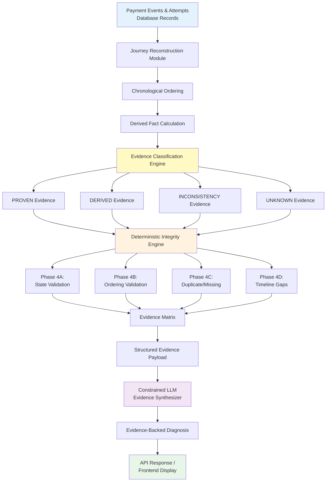

# PaymentTrace: Technical Architecture, Evaluation Methodology, and Future Extensions

**Document Type:** Technical Architecture & Evaluation Design  
**Status:** Prototype System with Proposed Evaluation Framework  
**Version:** 1.0  
**Date:** September 5, 2026

---

## Author

**Adhimulam Bhargav Sai Viswanath**

B.Tech — Computer Science and Engineering (Artificial Intelligence & Machine Learning)  
Vasireddy Venkatadri Institute of Technology (VVIT)  
Batch: 2023–2027

AI Engineer Intern, Paytm

**Affiliation Note:** This work represents an independent student buildathon project. It is not officially sponsored, endorsed, or deployed by VVIT or Paytm.

---

## Abstract

Payment debugging remains a significant operational challenge in digital payment systems due to fragmented telemetry across gateways, webhooks, merchant databases, and application logs. Engineers must manually reconstruct payment journeys and correlate inconsistent state information, leading to time-consuming investigations and inconsistent diagnostic quality.

This document presents **PaymentTrace**, a payment forensics prototype that combines deterministic journey reconstruction with constrained natural language synthesis. PaymentTrace reconstructs payment lifecycles from scattered records, classifies evidence into four categories (PROVEN, DERIVED, INCONSISTENCY, UNKNOWN), validates integrity through four deterministic phases (state validation, ordering validation, duplicate/missing detection, timeline gap detection), and generates evidence-backed natural language diagnoses using constrained Large Language Model (LLM) synthesis.

The current prototype implements the complete architecture using developer-created controlled scenarios and demonstrates 76/76 test passing verification. This document describes the system architecture, proposes an experimental evaluation methodology including baselines and ablation studies, defines evaluation metrics, discusses current findings from controlled scenarios, acknowledges limitations, and outlines future integration pathways toward real payment infrastructure.

**Keywords:** payment debugging, evidence classification, deterministic reasoning, LLM constraints, payment forensics, integrity validation, buildathon project

---

## 1. Introduction

### 1.1 Motivation

Digital payment systems process millions of transactions daily across distributed infrastructure: payment gateways, merchant applications, banking networks, webhook delivery systems, and observability platforms. When payments fail or behave unexpectedly, operational teams must investigate by correlating fragmented telemetry sources.

Current investigation workflows suffer from:
- **Manual correlation overhead:** Engineers query multiple systems and mentally reconstruct timelines
- **Inconsistent diagnostic quality:** Ad-hoc investigation produces variable results
- **Implicit uncertainty handling:** What cannot be determined is often left unclear
- **Speculation risk:** Root causes may be inferred without supporting evidence
- **Time consumption:** Single-incident investigation can require 15-30 minutes

Recent advances in Large Language Models (LLMs) have enabled natural language generation for technical domains. However, unconstrained LLM application to payment debugging introduces hallucination risks: LLMs may fabricate events, invent timestamps, or assert unsupported causal claims.

### 1.2 Contribution

This work presents a **deterministic-first architecture** where:

1. **Deterministic reconstruction** establishes the ground truth of what is known
2. **Evidence classification** categorizes facts by reliability (PROVEN/DERIVED/INCONSISTENCY/UNKNOWN)
3. **Integrity validation** detects violations through rule-based checks
4. **Constrained LLM synthesis** converts structured evidence into natural language without inventing facts

The system preserves **explicit uncertainty**: facts that cannot be established from available data are classified as UNKNOWN rather than speculated.

### 1.3 Current Status

PaymentTrace currently exists as a **functional prototype**:

- ✅ Complete architecture implemented
- ✅ Deterministic reconstruction and integrity engine operational
- ✅ Evidence classification system functional
- ✅ Constrained LLM integration implemented (Google Gemini)
- ✅ 76/76 automated tests passing
- ✅ Frontend demonstration interface complete
- ⚠️ Database uses developer-created controlled scenarios (not production data)
- ⚠️ Experimental evaluation not yet conducted
- ⚠️ Real payment gateway integration not implemented

This document describes the implemented system and proposes an evaluation methodology for future validation.

### 1.4 Document Structure

**Section 2:** Problem statement and real-world scenario  
**Section 3:** Design objectives  
**Section 4-8:** System architecture (reconstruction, integrity, evidence, LLM)  
**Section 9-11:** Proposed experimental methodology and evaluation metrics  
**Section 12:** Current prototype findings  
**Section 13:** Limitations  
**Section 14:** Future work  
**Section 15:** Discussion and conclusion

---

## 2. Problem Statement

### 2.1 Distributed Payment Architecture

Modern payment flows involve asynchronous communication across multiple systems:

```
Customer → Merchant App → Payment Gateway → Bank → Settlement
                ↓              ↓               ↓
           Order DB      Webhook Queue    Event Logs
```

**Telemetry fragmentation:**
- Gateway maintains payment attempt records
- Webhook system records event delivery
- Merchant database stores order state
- Application logs capture processing steps
- Observability platforms aggregate metrics

### 2.2 Illustrative Scenario: D-Mart UPI Purchase

Consider a retail payment scenario (illustrative example, not production data):

```
T+0s    Customer scans UPI QR code at D-Mart checkout (₹3,000)
T+2s    Merchant creates order: order_12345
T+3s    Payment attempt 1 initiated: payment_001
T+5s    Customer enters incorrect UPI PIN → Payment fails
T+15s   Customer retries: payment_002
T+18s   Bank authorizes payment
T+20s   Gateway captures payment
T+22s   Webhook #1 received: "payment.authorized"
T+45s   Webhook #2 received: "payment.captured" (delayed 25s)
T+60s   Customer checks: Merchant app shows "Order pending"
T+90s   Webhook processor runs batch job
T+92s   Order updated to "paid"
```

**Investigation challenges:**

When the customer reports "I paid but my order isn't confirmed," the support engineer must:

1. Query gateway: Which attempt succeeded?
2. Check webhooks: Did delivery succeed? Were events delayed?
3. Inspect merchant database: What is current order state?
4. Correlate timestamps: When did each event occur?
5. Identify inconsistencies: Why does gateway show "captured" but order shows "pending"?
6. Determine unknowns: Is data missing? What can't be proven?

**Manual investigation process:**
- Check payment gateway dashboard
- Query webhook delivery logs
- Execute SQL query against merchant database
- Compare timestamps manually
- Hypothesize about delays or failures
- Document findings in ticket

**Time:** 15-30 minutes per incident  
**Error-prone:** Manual correlation introduces mistakes  
**Inconsistent:** Different engineers produce different diagnostic quality

### 2.3 Core Challenge

**How can we systematically reconstruct payment journeys, classify evidence by reliability, validate integrity deterministically, and generate natural language explanations without hallucinating facts?**

---

## 3. Design Objectives

PaymentTrace architecture is designed to satisfy the following objectives:

### O1: Deterministic Ground Truth

**Objective:** Establish what is factually known through deterministic computation.

**Rationale:** Only deterministic logic can reliably establish facts from database records.

**Implementation:** Chronological ordering, timestamp arithmetic, state comparison, rule-based validation.

### O2: Explicit Evidence Classification

**Objective:** Categorize every fact by its evidentiary basis.

**Categories:**
- **PROVEN:** Directly from records
- **DERIVED:** Calculated deterministically
- **INCONSISTENCY:** Violated invariants
- **UNKNOWN:** Cannot be established

**Rationale:** Users must understand what is certain vs. uncertain.

### O3: Integrity Validation

**Objective:** Detect violations of payment lifecycle invariants.

**Phases:**
- Phase 4A: State machine validation
- Phase 4B: Timestamp ordering validation
- Phase 4C: Duplicate/missing event detection
- Phase 4D: Timeline gap detection

**Rationale:** Automated detection of common anomaly patterns.

### O4: Constrained Natural Language Generation

**Objective:** Convert structured evidence into readable explanations without hallucination.

**Approach:**
- LLM receives structured evidence payload
- Strict anti-hallucination constraints enforced
- LLM cannot query database, calculate facts, or classify evidence
- Structured JSON output validated with Pydantic

**Rationale:** Natural language improves accessibility while constraints prevent fabrication.

### O5: Uncertainty Preservation

**Objective:** Explicitly represent what cannot be determined.

**Principle:** `UNKNOWN ≠ FAILURE`

**Implementation:** Missing events classified as UNKNOWN, not as evidence of failure.

**Rationale:** Payment investigations require distinguishing "known failure" from "insufficient data."

---

## 4. System Architecture Overview



**Data Flow:**

1. **Input:** Payment events, attempts, order records
2. **Reconstruction:** Chronological timeline assembly
3. **Classification:** Evidence categorization (PROVEN/DERIVED/INCONSISTENCY/UNKNOWN)
4. **Validation:** Four-phase integrity checks
5. **Synthesis:** Constrained LLM natural language generation
6. **Output:** Evidence-backed diagnostic report

**Architectural Principle:**  
*Deterministic code decides what the system knows; the LLM decides how that evidence is communicated.*

---

## 5. Payment Journey Reconstruction

### 5.1 Data Model

**Database Schema (SQLite):**

```sql
-- Orders table
CREATE TABLE orders (
    order_id TEXT PRIMARY KEY,
    created_at DATETIME,
    amount INTEGER,
    currency TEXT,
    merchant_status TEXT
);

-- Payment attempts table
CREATE TABLE payment_attempts (
    attempt_id TEXT PRIMARY KEY,
    order_id TEXT,
    payment_id TEXT,
    method TEXT,
    attempt_number INTEGER,
    status TEXT,
    created_at DATETIME,
    FOREIGN KEY (order_id) REFERENCES orders(order_id)
);

-- Payment events table
CREATE TABLE payment_events (
    event_id TEXT PRIMARY KEY,
    order_id TEXT,
    payment_id TEXT,
    event_type TEXT,
    status TEXT,
    timestamp DATETIME,
    error_code TEXT,
    error_description TEXT,
    FOREIGN KEY (order_id) REFERENCES orders(order_id)
);
```

### 5.2 Reconstruction Algorithm

**Input:** `order_id`

**Steps:**

1. **Retrieve records:**
   ```python
   order = query_order(order_id)
   events = query_events(order_id)
   attempts = query_attempts(order_id)
   ```

2. **Chronological ordering:**
   ```python
   events = sorted(events, key=lambda e: e.timestamp)
   ```

3. **Derived fact calculation:**
   ```python
   total_attempts = len(attempts)
   retry_count = max(0, total_attempts - 1)
   journey_duration = calculate_duration(events)
   gaps = calculate_timing_gaps(events)
   ```

4. **Evidence classification:**
   ```python
   evidence = []
   
   # PROVEN: Direct from records
   for event in events:
       evidence.append(Evidence(
           category="PROVEN",
           statement=f"Event '{event.event_type}' at {event.timestamp}",
           source=f"payment_events.event_id={event.event_id}"
       ))
   
   # DERIVED: Calculated
   evidence.append(Evidence(
       category="DERIVED",
       statement=f"Total attempts: {total_attempts}",
       source="count(payment_attempts)"
   ))
   ```

**Output:** `PaymentJourney` object containing:
- Order details
- Chronologically ordered events
- Payment attempts
- Evidence list (PROVEN/DERIVED/INCONSISTENCY/UNKNOWN)

### 5.3 Implementation

**Module:** `backend/services/reconstruction.py`  
**Function:** `reconstruct_journey(order_id: str) -> PaymentJourney`  
**Language:** Python (async/await with `aiosqlite`)

---

## 6. Deterministic Integrity Engine

The integrity engine implements four phases of automated validation.

### 6.1 Phase 4A: State Machine Validation

**Objective:** Detect invalid payment lifecycle transitions.

**Valid Lifecycle:**

```
created (initiated) → authorized → captured (success)
                   ↓
                 failed (failure)
```

**Validation Rules:**

| Violation | Detection | Classification |
|-----------|-----------|----------------|
| Captured without authorization | `payment.captured` exists, no prior `payment.authorized` | `INCONSISTENCY` |
| Terminal state regression | `captured` → `initiated` | `INCONSISTENCY` |
| Invalid progression | State transitions violating lifecycle order | `INCONSISTENCY` |

**Algorithm:**

```python
def validate_state_transitions(events: List[PaymentEvent]) -> List[Evidence]:
    violations = []
    
    # Group by payment_id
    for payment_id, payment_events in group_by_payment_id(events):
        has_authorized = any(e.event_type == "payment.authorized" 
                           for e in payment_events)
        has_captured = any(e.event_type == "payment.captured" 
                          for e in payment_events)
        
        # Rule: captured without authorized
        if has_captured and not has_authorized:
            violations.append(Evidence(
                category="INCONSISTENCY",
                statement=f"Payment {payment_id} captured without authorization",
                source="state_machine_validation"
            ))
    
    return violations
```

**Test Scenario:** Scenario C (order_scenario_c) demonstrates Phase 4A detection.

---

### 6.2 Phase 4B: Timestamp Ordering Validation

**Objective:** Detect chronologically impossible event sequences.

**Validation Rules:**

| Violation | Detection | Classification |
|-----------|-----------|----------------|
| Out-of-order lifecycle events | `authorized` timestamp < `initiated` timestamp | `INCONSISTENCY` |
| Impossible causality | Effect timestamp precedes cause timestamp | `INCONSISTENCY` |

**Algorithm:**

```python
def validate_timestamp_ordering(events: List[PaymentEvent]) -> List[Evidence]:
    violations = []
    
    for payment_id, payment_events in group_by_payment_id(events):
        # Get event timestamps
        initiated_time = find_event_time(payment_events, "payment.initiated")
        authorized_time = find_event_time(payment_events, "payment.authorized")
        captured_time = find_event_time(payment_events, "payment.captured")
        
        # Check: authorized must be after initiated
        if authorized_time and initiated_time:
            if authorized_time < initiated_time:
                violations.append(Evidence(
                    category="INCONSISTENCY",
                    statement=f"Authorized at {authorized_time} before initiated at {initiated_time}",
                    source="timestamp_ordering_validation"
                ))
        
        # Check: captured must be after authorized
        if captured_time and authorized_time:
            if captured_time < authorized_time:
                violations.append(Evidence(
                    category="INCONSISTENCY",
                    statement=f"Captured at {captured_time} before authorized at {authorized_time}",
                    source="timestamp_ordering_validation"
                ))
    
    return violations
```

**Test Scenario:** Scenario E (order_scenario_e) demonstrates Phase 4B detection.

---

### 6.3 Phase 4C: Duplicate and Missing Event Detection

**Objective:** Identify repeated lifecycle events and absent expected events.

#### 6.3.1 Duplicate Detection

**Validation Rules:**

| Event Type | Duplication Policy | Classification |
|------------|-------------------|----------------|
| `payment.captured` | At most one per `payment_id` | `INCONSISTENCY` |
| `payment.authorized` | At most one per `payment_id` | `INCONSISTENCY` |
| `payment.failed` | At most one per `payment_id` | `INCONSISTENCY` |
| `webhook.received` | Multiple allowed (legitimate retries) | N/A |

**Algorithm:**

```python
def detect_duplicate_events(events: List[PaymentEvent]) -> List[Evidence]:
    violations = []
    
    for payment_id, payment_events in group_by_payment_id(events):
        # Count each lifecycle event type
        event_counts = Counter(e.event_type for e in payment_events 
                              if e.event_type != "webhook.received")
        
        for event_type, count in event_counts.items():
            if count > 1:
                violations.append(Evidence(
                    category="INCONSISTENCY",
                    statement=f"Duplicate {event_type} detected ({count} occurrences)",
                    source=f"duplicate_detection: {payment_id}"
                ))
    
    return violations
```

**Test Scenario:** Scenario F (order_scenario_f) demonstrates duplicate detection.

#### 6.3.2 Missing Event Detection

**Validation Rules:**

| Condition | Expected Event | Classification |
|-----------|---------------|----------------|
| `authorized` exists, no `initiated` | `payment.initiated` | `UNKNOWN` |
| `captured` exists, no `initiated` | `payment.initiated` | `UNKNOWN` |

**Important:** Missing events are classified as `UNKNOWN`, not `INCONSISTENCY`, because:
- The event may have occurred but wasn't recorded
- The event may exist in a system not yet queried
- Absence of evidence ≠ evidence of absence

**Algorithm:**

```python
def detect_missing_events(events: List[PaymentEvent]) -> List[Evidence]:
    findings = []
    
    for payment_id, payment_events in group_by_payment_id(events):
        event_types = {e.event_type for e in payment_events}
        
        # Check: authorized without initiated
        if "payment.authorized" in event_types and "payment.initiated" not in event_types:
            findings.append(Evidence(
                category="UNKNOWN",
                statement=f"No payment.initiated found when payment.authorized exists",
                source=f"missing_event_detection: {payment_id}"
            ))
    
    return findings
```

**Test Scenario:** Scenario G (order_scenario_g) demonstrates missing event detection.

---

### 6.4 Phase 4D: Timeline Gap Detection

**Objective:** Flag unusual timing patterns without false positives.

**Design Philosophy:** Phase 4D uses **conservative thresholds** to detect timing anomalies while avoiding false positives for legitimate delays. All findings are classified as `UNKNOWN`, not `INCONSISTENCY`, because timing anomalies do not prove payment failure.

#### 6.4.1 Thresholds

Defined in `backend/services/integrity.py`:

```python
THRESHOLD_INIT_TO_AUTH_SECONDS = 90
THRESHOLD_AUTH_TO_CAPTURE_SECONDS = 45
THRESHOLD_NEAR_ZERO_MS = 50
```

**Rationale:**

- **90 seconds (initiated → authorized):** Authorization can legitimately take 30-60 seconds (customer enters PIN, 2FA, bank processing). Threshold set to 90s to avoid flagging Scenario B's 45s delay.
- **45 seconds (authorized → captured):** Capture typically occurs within 5-10 seconds. 45s threshold allows for processing delays.
- **50 milliseconds (near-zero):** Sub-50ms gaps may indicate timestamp precision issues or synchronous processing rather than realistic network latency.

#### 6.4.2 Detection Algorithm

```python
def detect_timeline_gaps(events: List[PaymentEvent]) -> List[Evidence]:
    findings = []
    
    for payment_id, payment_events in group_by_payment_id(events):
        times = extract_lifecycle_timestamps(payment_events)
        
        # Check: initiated → authorized gap
        if times.initiated and times.authorized:
            gap = (times.authorized - times.initiated).total_seconds()
            if gap > THRESHOLD_INIT_TO_AUTH_SECONDS:
                findings.append(Evidence(
                    category="UNKNOWN",
                    statement=f"Unusually long gap ({gap:.1f}s) between initiated and authorized",
                    source="timeline_gap_detection: initiated_to_authorized"
                ))
        
        # Check: authorized → captured gap
        if times.authorized and times.captured:
            gap = (times.captured - times.authorized).total_seconds()
            if gap > THRESHOLD_AUTH_TO_CAPTURE_SECONDS:
                findings.append(Evidence(
                    category="UNKNOWN",
                    statement=f"Unusually long gap ({gap:.1f}s) between authorized and captured",
                    source="timeline_gap_detection: authorized_to_captured"
                ))
        
        # Check: near-zero gaps
        for i in range(len(payment_events) - 1):
            gap_ms = (payment_events[i+1].timestamp - payment_events[i].timestamp).total_seconds() * 1000
            if 0 < gap_ms < THRESHOLD_NEAR_ZERO_MS:
                findings.append(Evidence(
                    category="UNKNOWN",
                    statement=f"Near-zero gap ({gap_ms:.0f}ms) between consecutive events",
                    source="timeline_gap_detection: near_zero"
                ))
    
    return findings
```

**Test Scenarios:**
- **Scenario B (order_scenario_b):** 45s gap → **No detection** (below 90s threshold) ✓
- **Scenario H (order_scenario_h):** 120s gap → **Detection** (above 90s threshold)
- **Scenario I (order_scenario_i):** 20ms gaps → **Detection** (below 50ms threshold)

**Key Verification:** Scenario B correctly does NOT trigger Phase 4D, confirming the system avoids false positives for legitimate authorization delays.

---

## 7. Evidence Model

### 7.1 Evidence Categories

PaymentTrace classifies every fact into exactly one of four categories:

#### 7.1.1 PROVEN

**Definition:** Directly supported by database records.

**Source:** `SELECT` queries against `orders`, `payment_attempts`, `payment_events` tables.

**Examples:**
- "Event 'payment.captured' occurred at 2026-09-05T15:00:10Z"
- "Payment attempt 1 using UPI resulted in status 'failed'"
- "Order amount: 50000 INR"

**Reliability:** Highest (assuming database integrity)

#### 7.1.2 DERIVED

**Definition:** Deterministically calculated from database records.

**Source:** Timestamp arithmetic, counting, aggregation, duration calculations.

**Examples:**
- "Journey duration: 54.2 seconds"
- "Total payment attempts: 2"
- "Retry count: 1"
- "Time between attempt 1 and attempt 2: 45 seconds"

**Reliability:** High (depends on timestamp accuracy and calculation correctness)

#### 7.1.3 INCONSISTENCY

**Definition:** A contradiction or violated invariant detected by deterministic rules.

**Source:** Phase 4A/B/C validation logic.

**Examples:**
- "Payment captured without prior authorization event" (Phase 4A)
- "Authorized timestamp occurs before initiated timestamp" (Phase 4B)
- "Two payment.captured events detected for payment_id pay_001" (Phase 4C)
- "Merchant order status 'created' conflicts with final payment status 'captured'"

**Reliability:** High (rule-based detection)

**Important:** INCONSISTENCY indicates a violated invariant but does not automatically prove the root cause.

#### 7.1.4 UNKNOWN

**Definition:** Cannot be established from currently available evidence.

**Source:** Missing data detection (Phase 4C), timing anomalies (Phase 4D).

**Examples:**
- "No payment.initiated event found when payment.authorized exists"
- "Unusually long gap (120s) detected between initiated and authorized"
- "Error code 'BAD_REQUEST_ERROR' recorded but no additional error details available"

**Reliability:** N/A (represents absence of information)

**Critical Principle:** `UNKNOWN ≠ FAILURE`

An unknown fact does not prove payment failure. It indicates:
- Data may be missing from queried systems
- Evidence may exist in systems not yet integrated
- Timing patterns are unusual but not necessarily problematic

### 7.2 Evidence Traceability

Every `Evidence` object includes:

```python
@dataclass
class Evidence:
    category: Literal["PROVEN", "DERIVED", "INCONSISTENCY", "UNKNOWN"]
    statement: str  # Human-readable fact
    source: str     # Traceability (table.column, function name, rule ID)
```

**Example:**

```python
Evidence(
    category="PROVEN",
    statement="Event 'payment.captured' occurred at 2026-09-05T15:00:10Z",
    source="payment_events.event_id=evt_123"
)
```

**Traceability enables:**
- Verification: Users can trace facts back to source records
- Auditing: Diagnostic reasoning is transparent
- Debugging: Incorrect evidence can be traced to source logic

---

## 8. AI Boundary and LLM Constraints

### 8.1 Design Principle

**"Deterministic code decides what the system knows; the LLM decides how that evidence is communicated."**

The LLM is strictly a **natural language synthesis layer**. It does not determine facts, calculate metrics, or classify evidence.

### 8.2 What the LLM Does

✅ Receives structured evidence payload (PROVEN/DERIVED/INCONSISTENCY/UNKNOWN)  
✅ Converts evidence into natural language narrative  
✅ Synthesizes technical explanation from facts  
✅ Organizes information into sections (summary, known facts, unknowns, recommendations)

### 8.3 What the LLM Must NOT Do

❌ Query the database  
❌ Calculate journey duration, attempt count, or timing gaps  
❌ Determine whether events are out of order  
❌ Classify evidence categories  
❌ Invent events not present in evidence  
❌ Infer root causes without supporting evidence  
❌ Convert `UNKNOWN` evidence into `PROVEN` claims  
❌ Assert payment failure if later evidence shows success  
❌ Speculate beyond available evidence

### 8.4 Anti-Hallucination Constraints

PaymentTrace enforces **13 anti-hallucination rules** through system prompts:

1. Base all claims on provided evidence
2. Do not invent events, timestamps, or payment IDs
3. Do not infer customer intent beyond what evidence shows
4. Preserve UNKNOWN as uncertain (do not convert to claims)
5. Do not infer network/bank failures without explicit evidence
6. Use exact timestamps from evidence
7. Use exact attempt counts from evidence
8. Cite evidence sources when making claims
9. Do not claim payment failed if evidence shows success
10. Distinguish PROVEN from DERIVED from INCONSISTENCY from UNKNOWN
11. Do not speculate about causes not supported by evidence
12. If multiple interpretations exist, acknowledge uncertainty
13. Generate structured JSON output matching schema

### 8.5 Implementation

**LLM Provider:** Google Gemini (`gemini-3.7-flash`)

**System Prompt Structure:**

```python
system_prompt = f"""
You are a payment diagnostic system that generates evidence-backed explanations.

CRITICAL RULES:
1. Base ALL claims on the provided evidence.
2. Do NOT invent events, timestamps, or payment IDs.
3. Do NOT calculate journey duration or attempt count (already provided).
4. PRESERVE evidence categories exactly:
   - PROVEN: Directly from records
   - DERIVED: Calculated deterministically
   - INCONSISTENCY: Detected violation
   - UNKNOWN: Cannot be determined
5. Do NOT convert UNKNOWN into claims.
6. Do NOT infer root causes without explicit evidence.

Evidence provided:
{evidence_payload}

Generate a JSON response matching this schema:
{{
  "summary": "Brief overall assessment",
  "what_happened": "Narrative explanation",
  "what_is_known": ["Fact 1", "Fact 2", ...],
  "what_cannot_be_determined": ["Unknown 1", "Unknown 2", ...],
  "recommended_action": "Next steps"
}}
"""
```

**Response Validation:**

```python
from pydantic import BaseModel

class DiagnosisResponse(BaseModel):
    summary: str
    what_happened: str
    what_is_known: List[str]
    what_cannot_be_determined: List[str]
    recommended_action: str

# Validate LLM output
diagnosis = DiagnosisResponse(**llm_response)
```

**Error Handling:**

If LLM output fails Pydantic validation:
- Log the error
- Return 503 Service Unavailable
- Frontend displays error message with evidence payload

### 8.6 Testing Strategy

**Unit Tests:** Mock LLM responses to test integration without external API calls

```python
@pytest.fixture
def mock_gemini_response():
    return {
        "summary": "Payment succeeded after retry",
        "what_happened": "Initial attempt failed due to incorrect PIN...",
        "what_is_known": ["Attempt 1 failed", "Attempt 2 succeeded"],
        "what_cannot_be_determined": ["Exact user action during retry"],
        "recommended_action": "No action required"
    }

@patch('backend.services.llm.call_gemini_api')
async def test_diagnosis_generation(mock_call, mock_gemini_response):
    mock_call.return_value = mock_gemini_response
    diagnosis = await generate_diagnosis(journey)
    assert diagnosis.summary == "Payment succeeded after retry"
```

**Integration Tests:** (Future work) Test with real Gemini API to validate constraint adherence

---

## 9. Experimental Methodology

### 9.1 Current Status

The current prototype demonstrates architectural feasibility using developer-created controlled scenarios. **Experimental evaluation against baselines has not yet been conducted.**

This section proposes an evaluation methodology for future validation.

### 9.2 Research Question

**Can a deterministic evidence reconstruction layer combined with constrained natural-language synthesis improve the factual consistency and diagnostic usefulness of payment incident explanations compared to unconstrained LLM-based approaches?**

### 9.3 Proposed Baselines

To evaluate PaymentTrace, we propose comparison against the following baseline systems:

#### Baseline B0: Raw Payment Records

**Input:** Unstructured payment event descriptions  
**Processing:** None  
**Output:** Raw database records (JSON)

**Purpose:** Establish lower bound (no automated processing)

#### Baseline B1: Timeline Reconstruction Only

**Input:** Structured payment records  
**Processing:** Chronological ordering + derived facts  
**Output:** Structured timeline (JSON)

**Purpose:** Measure value of reconstruction without integrity validation or LLM

#### Baseline B2: Reconstruction + Integrity (No LLM)

**Input:** Structured payment records  
**Processing:** Reconstruction + Phase 4A/B/C/D + Evidence classification  
**Output:** Structured evidence payload (JSON)

**Purpose:** Measure deterministic detection capability without natural language generation

#### Baseline B3: Raw LLM (No Constraints)

**Input:** Structured payment records  
**Processing:** Direct LLM inference (no evidence classification, no constraints)  
**Output:** Free-form natural language explanation

**Purpose:** Measure unconstrained LLM performance

#### Proposed System P: PaymentTrace (Full Architecture)

**Input:** Structured payment records  
**Processing:** Reconstruction + Integrity + Evidence Classification + Constrained LLM  
**Output:** Evidence-backed natural language diagnosis

**Purpose:** Proposed system for evaluation

### 9.4 Evaluation Dataset

**Current:** 8 developer-created controlled scenarios (A, B, C, E, F, G, H, I)

**Proposed Expansion:**

1. **Phase 1:** Expand controlled scenarios
   - More payment methods (card, netbanking, wallet, BNPL)
   - More failure types (timeout, network error, insufficient funds, invalid card)
   - Multi-attempt retries with varying delays
   - Webhook delivery delays and duplicates
   - Target: 50-100 controlled scenarios with ground truth labels

2. **Phase 2:** Payment gateway test-mode integration
   - Use test-mode API to generate real gateway event sequences
   - Controlled test transactions (no real money)
   - Deterministic replay capability
   - Target: 200-500 test-mode traces

3. **Phase 3:** Sanitized real traces (subject to legal/ethical approval)
   - Anonymized/pseudonymized identifiers
   - Privacy-compliant data handling
   - Institutional review board (IRB) approval if required
   - Target: 1,000+ real incident traces

**Ground Truth Labeling:**

For each scenario, manually label:
- Expected anomalies (state violations, ordering issues, duplicates, gaps)
- Provably correct facts vs. unknown information
- Terminal vs. intermediate states
- Expected INCONSISTENCY vs. UNKNOWN classifications
- Gold-standard diagnostic explanation

---

## 10. Ablation Study

To isolate component contributions, we propose testing the following configurations:

| Config | Reconstruction | Phase 4A | Phase 4B | Phase 4C | Phase 4D | Evidence Model | LLM | LLM Constraints |
|--------|---------------|----------|----------|----------|----------|----------------|-----|-----------------|
| **A0** | ❌ | ❌ | ❌ | ❌ | ❌ | ❌ | ✅ | ❌ |
| **A1** | ✅ | ❌ | ❌ | ❌ | ❌ | ❌ | ✅ | ❌ |
| **A2** | ✅ | ✅ | ✅ | ✅ | ✅ | ❌ | ❌ | N/A |
| **A3** | ✅ | ✅ | ✅ | ✅ | ✅ | ✅ | ❌ | N/A |
| **A4** | ✅ | ✅ | ✅ | ✅ | ✅ | ✅ | ✅ | ❌ |
| **A5** | ✅ | ✅ | ✅ | ✅ | ✅ | ✅ | ✅ | ✅ |
| **A6** | ✅ | ✅ | ✅ | ✅ | ❌ | ✅ | ✅ | ✅ |
| **A7** | ✅ | ✅ | ✅ | ❌ | ❌ | ✅ | ✅ | ✅ |

**Configuration Descriptions:**

- **A0:** Raw LLM only (no reconstruction, no constraints)
- **A1:** LLM + timeline reconstruction
- **A2:** Deterministic only (no LLM)
- **A3:** Deterministic + evidence model (no LLM)
- **A4:** Full system with unconstrained LLM
- **A5:** Full system with constrained LLM (proposed PaymentTrace)
- **A6:** PaymentTrace without Phase 4D (timing detection)
- **A7:** PaymentTrace without Phase 4C/4D (duplicate/missing/timing)

**Analysis:**

- **A0 vs A5:** Overall system effectiveness
- **A2 vs A5:** LLM contribution to diagnostic usefulness
- **A3 vs A5:** Natural language generation value
- **A4 vs A5:** Constraint effectiveness
- **A6 vs A5:** Phase 4D (timing) contribution
- **A7 vs A5:** Phase 4C/4D (duplicate/missing/timing) contribution

**Important:** No numerical results are reported because experiments have not yet been conducted.

---

## 11. Evaluation Metrics

### 11.1 Detection Metrics

Measure deterministic integrity validation performance:

#### Anomaly Detection Precision

\[
\text{Precision} = \frac{\text{True Positives}}{\text{True Positives} + \text{False Positives}}
\]

Where:
- True Positive: Correctly detected anomaly (Phase 4A/B/C/D)
- False Positive: Incorrectly flagged normal behavior as anomaly

**Goal:** Precision ≥ 95% (avoid false alarms)

#### Anomaly Detection Recall

\[
\text{Recall} = \frac{\text{True Positives}}{\text{True Positives} + \text{False Negatives}}
\]

Where:
- False Negative: Missed actual anomaly

**Goal:** Recall ≥ 90% (minimize missed anomalies)

#### F1 Score

\[
F1 = 2 \times \frac{\text{Precision} \times \text{Recall}}{\text{Precision} + \text{Recall}}
\]

**Goal:** F1 ≥ 0.92

### 11.2 Evidence Attribution Metrics

Measure LLM factual consistency:

#### Evidence Attribution Precision

\[
\text{Attribution Precision} = \frac{\text{Claims Supported by Evidence}}{\text{Total Claims Generated}}
\]

Where:
- Claim: Any factual statement in LLM-generated diagnosis
- Supported: Claim can be traced to evidence payload

**Measurement:** Human evaluators verify each claim against evidence payload

**Goal:** Attribution Precision ≥ 98% (minimal hallucination)

#### Unsupported Claim Rate

\[
\text{Unsupported Rate} = \frac{\text{Claims Without Evidence}}{\text{Total Claims Generated}}
\]

**Goal:** Unsupported Rate ≤ 2%

#### Unknown Preservation Rate

\[
\text{Unknown Preservation} = \frac{\text{UNKNOWN Evidence Maintained as Uncertain}}{\text{Total UNKNOWN Evidence}}
\]

**Measurement:** Check if LLM converts UNKNOWN evidence into definitive claims

**Goal:** Unknown Preservation ≥ 95%

### 11.3 Diagnostic Quality Metrics

#### Factual Consistency Score

Human evaluators rate each claim:
- **1.0:** Provably correct (matches evidence exactly)
- **0.7:** Likely correct but unverified
- **0.5:** Uncertain
- **0.0:** Incorrect

**Aggregation:** Mean score across all claims

**Goal:** Factual Consistency ≥ 0.90

#### Diagnostic Usefulness Score

Technical reviewers (payment operations engineers) rate using 1-5 Likert scale:

1. **Actionability:** Does the diagnosis suggest next steps?
2. **Completeness:** Does it address the key questions?
3. **Clarity:** Is the explanation understandable?

**Aggregation:** Mean across dimensions and reviewers

**Goal:** Usefulness ≥ 4.0 / 5.0

### 11.4 Operational Metrics

#### Diagnosis Latency

\[
\text{Latency} = T_{\text{output}} - T_{\text{input}}
\]

**Components:**
- Database query time
- Reconstruction time
- Integrity validation time
- LLM inference time

**Goal:** Latency ≤ 5 seconds (P95)

#### Investigator Time-to-Diagnosis

**Measurement:** User study comparing:
- Manual investigation time (baseline)
- Investigation time with PaymentTrace assistance

**Goal:** Time reduction ≥ 50%

### 11.5 Human Evaluation Protocol

**Evaluators:** Payment operations engineers, backend developers

**Evaluation Questions:**
1. Does the diagnosis contain factual errors? (yes/no + specifics)
2. Are unsupported claims present? (yes/no + examples)
3. Does the explanation help you understand what happened? (1-5 Likert)
4. Would you trust this diagnosis to inform production decisions? (yes/no + rationale)
5. What information is missing that you would need?

**Blinding:** Evaluators should not know which system (baseline vs proposed) generated each diagnosis

**Sample Size:** Minimum 30 evaluators × 20 scenarios = 600 evaluations

**Statistical Analysis:** ANOVA to detect significant differences between systems

**Important:** No human evaluation has been conducted yet. This protocol is proposed for future work.

---

## 12. Current Prototype Findings

### 12.1 Implementation Status

**Completed:**
- ✅ Backend API (FastAPI)
- ✅ Database schema and fixtures (SQLite)
- ✅ Journey reconstruction module
- ✅ Evidence classification engine
- ✅ Phase 4A/B/C/D integrity validation
- ✅ Constrained LLM integration (Gemini)
- ✅ Frontend demonstration interface
- ✅ 76 automated tests

**Not Implemented:**
- ❌ Real payment gateway integration
- ❌ Production database connection
- ❌ Experimental evaluation against baselines
- ❌ Human evaluation study
- ❌ Large-scale performance testing

### 12.2 Test Results

**Test Execution:**

```bash
$ pytest -v
================================ test session starts =================================
collected 76 items

tests/test_reconstruction.py::test_event_ordering PASSED                       [  1%]
tests/test_reconstruction.py::test_attempt_counting PASSED                     [  2%]
...
tests/test_integrity.py::test_phase_4d_timeline_gap_detection PASSED           [100%]

================================ 76 passed in 2.21s ==================================
```

**Test Breakdown:**
- 10 tests: Journey reconstruction logic
- 8 tests: API endpoint contracts
- 8 tests: LLM service integration (mocked)
- 8 tests: Diagnosis endpoint (mocked)
- 42 tests: Integrity validation (Phase 4A/B/C/D)

**Coverage:**
- Event chronological ordering: ✅ Verified
- Attempt/retry counting: ✅ Verified
- Duration calculations: ✅ Verified
- State machine validation (Phase 4A): ✅ Verified
- Ordering validation (Phase 4B): ✅ Verified
- Duplicate detection (Phase 4C): ✅ Verified
- Missing event detection (Phase 4C): ✅ Verified
- Timeline gap detection (Phase 4D): ✅ Verified
- Evidence classification: ✅ Verified

### 12.3 Scenario-Specific Findings

#### Finding 1: Scenario B Threshold Calibration

**Scenario:** `order_scenario_b` (Late Authorization)

**Timeline:**
- Initiated → Authorized: 45 seconds

**Phase 4D Threshold:** 90 seconds

**Observed Behavior:** No Phase 4D detection (correct)

**Interpretation:** The 90-second threshold successfully avoids false positives for legitimate authorization delays.

**Verification:** Test `test_phase_4d_no_false_positive_scenario_b` passes

#### Finding 2: Scenario C State Violation Detection

**Scenario:** `order_scenario_c` (Invalid State Transition)

**Violation:** `payment.captured` without prior `payment.authorized`

**Phase 4A Detection:** ✅ INCONSISTENCY evidence generated

**Observed Behavior:**

```python
Evidence(
    category="INCONSISTENCY",
    statement="Payment pay_c_invalid: payment.captured occurred without prior payment.authorized event",
    source="state_machine_validation"
)
```

**Interpretation:** Phase 4A correctly detects invalid state machine transitions.

**Verification:** Test `test_phase_4a_invalid_state_transition` passes

#### Finding 3: Scenario E Ordering Violation Detection

**Scenario:** `order_scenario_e` (Out-of-Order Events)

**Violation:** `authorized` timestamp (15:00:00) < `initiated` timestamp (15:00:10)

**Phase 4B Detection:** ✅ INCONSISTENCY evidence generated

**Interpretation:** Phase 4B correctly detects chronologically impossible event sequences.

**Verification:** Test `test_phase_4b_out_of_order_events` passes

#### Finding 4: Scenario F Duplicate Event Detection

**Scenario:** `order_scenario_f` (Duplicate Lifecycle Event)

**Violation:** Two `payment.captured` events for `payment_id=pay_f_duplicate`

**Phase 4C Detection:** ✅ INCONSISTENCY evidence generated

**Interpretation:** Phase 4C correctly detects duplicate lifecycle events.

**Verification:** Test `test_phase_4c_duplicate_event_detection` passes

#### Finding 5: Scenario G Missing Event Detection

**Scenario:** `order_scenario_g` (Missing Expected Event)

**Condition:** `payment.authorized` exists, no `payment.initiated` found

**Phase 4C Detection:** ✅ UNKNOWN evidence generated (not INCONSISTENCY)

**Interpretation:** Missing events are conservatively classified as UNKNOWN because absence of record ≠ proof event never occurred.

**Verification:** Test `test_phase_4c_missing_event_detection` passes

#### Finding 6: Scenario H Long Gap Detection

**Scenario:** `order_scenario_h` (Long Authorization Gap)

**Timeline:** Initiated → Authorized: 120 seconds

**Phase 4D Threshold:** 90 seconds

**Phase 4D Detection:** ✅ UNKNOWN evidence generated

**Observed Behavior:**

```python
Evidence(
    category="UNKNOWN",
    statement="Payment pay_h_longdelay: Unusually long gap (120.0s) detected between initiated and authorized",
    source="timeline_gap_detection: initiated_to_authorized"
)
```

**Interpretation:** Phase 4D correctly detects long gaps and classifies them as UNKNOWN (not proof of failure).

**Verification:** Test `test_phase_4d_long_gap_detection` passes

#### Finding 7: Scenario I Near-Zero Timing Detection

**Scenario:** `order_scenario_i` (Near-Zero Timing Gaps)

**Timeline:**
- Initiated → Authorized: 20 milliseconds
- Authorized → Captured: 20 milliseconds

**Phase 4D Threshold:** 50 milliseconds

**Phase 4D Detection:** ✅ UNKNOWN evidence generated

**Interpretation:** Near-zero gaps may indicate timestamp precision issues or synchronous processing.

**Verification:** Test `test_phase_4d_near_zero_timing` passes

### 12.4 Limitations of Current Findings

**Important:** Current findings are based on developer-created controlled scenarios with known ground truth. They do NOT represent:

- ❌ Real-world incident detection accuracy
- ❌ Performance on production payment traces
- ❌ Comparison against baseline systems
- ❌ Human evaluation of diagnostic usefulness
- ❌ Statistical validation on large datasets

Current findings demonstrate **architectural feasibility** and **internal consistency**, not real-world effectiveness.

---

## 13. Limitations

### 13.1 Data Limitations

**L1: Synthetic Data Only**

Current database uses developer-created controlled scenarios. Real payment behavior may include:
- Gateway-specific event schemas
- Provider-specific state transitions
- Real network latency distributions
- Production-scale volume and diversity

**L2: No Production Integration**

No connections to:
- Real payment gateways (Razorpay, Stripe, PayU)
- Webhook delivery systems
- Merchant databases
- Application logs
- Observability platforms

### 13.2 Detection Limitations

**L3: Heuristic Thresholds**

Phase 4D timing thresholds (90s, 45s, 50ms) are prototype heuristics requiring domain validation.

**L4: Payment Method Generalization**

Current implementation uses generic payment flow. Method-specific rules (UPI vs card vs netbanking vs wallet) not implemented.

**L5: Gateway Schema Variance**

Real payment gateways have different:
- Event type naming conventions
- Status value semantics
- Webhook payload structures
- Retry behaviors

### 13.3 Evaluation Limitations

**L6: No Baseline Comparison**

System not experimentally compared against:
- Raw LLM approaches
- Unconstrained LLM approaches
- Manual investigation workflows

**L7: No Human Evaluation**

Diagnostic usefulness not validated with:
- Payment operations engineers
- Backend developers
- Customer support teams

**L8: No Statistical Validation**

Precision/recall metrics not measured on:
- Real incident datasets
- Large-scale trace volumes
- Cross-gateway scenarios

### 13.4 Operational Limitations

**L9: Single Journey Analysis**

Current scope limited to individual payment journeys. Does not perform:
- Population-level pattern detection
- Cross-merchant anomaly clustering
- Historical trend analysis

**L10: Prototype Scale**

Not designed for:
- High-volume production workloads
- Real-time monitoring
- Concurrent request handling at scale

**L11: Missing Production Features**

No implementation of:
- Authentication and authorization
- Audit logging
- Observability and monitoring
- Rate limiting and backpressure
- Secure secret management
- Data retention policies

### 13.5 AI Limitations

**L12: LLM Dependency**

Diagnosis quality depends on:
- Gemini model behavior and updates
- API availability and latency
- Cost constraints at scale

**L13: Constraint Enforcement**

Anti-hallucination constraints enforced through system prompts. No formal verification that LLM adheres to constraints in all cases.

**L14: Causality Inference**

System cannot prove causes absent from telemetry:
- Bank-side network failures
- Customer device issues
- ISP connectivity problems
- Internal gateway processing failures

### 13.6 Ethical and Compliance Limitations

**L15: Privacy Compliance**

Real-world deployment requires:
- GDPR compliance (if handling EU customers)
- PCI-DSS compliance (if handling card data)
- Data protection impact assessments
- User consent mechanisms

**L16: No Financial Authority**

System should NOT be used as:
- Financial reconciliation system
- Authoritative payment status source
- Regulatory compliance tool

**L17: Student Project Constraints**

As an independent student buildathon project:
- No access to production payment data
- No institutional approval for real customer data
- No long-term maintenance commitment
- No service-level agreements

---

## 14. Future Work

### 14.1 Near-Term Extensions (3-6 months)

**E1: Payment Gateway Test-Mode Integration**

Connect to payment gateway test-mode APIs:
- Razorpay test mode
- Stripe test mode
- Controlled test transactions
- Real gateway event schemas

**E2: Webhook Log Ingestion**

Integrate webhook delivery records:
- Delivery timestamps
- Retry attempts
- Delivery failures
- Payload contents

**E3: Expanded Scenario Library**

Create 50-100 additional controlled scenarios covering:
- More payment methods (card, netbanking, wallet, BNPL)
- More failure types (timeout, network, insufficient funds, invalid card, expired card)
- Multi-attempt retries with varying delays
- Webhook duplication and ordering issues

**E4: Real Gemini API Testing**

Test with production Gemini API:
- Measure constraint adherence
- Identify edge cases where constraints fail
- Optimize system prompts
- Measure inference latency at scale

### 14.2 Medium-Term Extensions (6-12 months)

**E5: Payment-Method-Specific Rules**

Implement method-specific integrity validation:
- UPI: NPCI-specific event sequences
- Card: 3DS authentication flows
- Netbanking: Bank-specific redirection patterns
- Wallet: Balance check and deduction logic

**E6: Cross-Gateway Normalization**

Handle schema variance across payment providers:
- Unified event type taxonomy
- Status value mapping
- Timestamp format normalization

**E7: Human Evaluation Study**

Conduct formal evaluation:
- Recruit 30+ payment operations engineers
- Blind comparison against baselines
- Measure diagnostic usefulness
- Measure investigator time-to-diagnosis
- Statistical significance testing

**E8: Baseline System Implementation**

Implement proposed baselines:
- B0: Raw records
- B1: Timeline reconstruction only
- B2: Deterministic only (no LLM)
- B3: Unconstrained LLM

**E9: Ablation Study Execution**

Run ablation experiments:
- Configurations A0-A7
- Measure detection precision/recall
- Measure attribution precision
- Measure diagnostic usefulness

### 14.3 Long-Term Vision (12+ months)

**E10: Production Infrastructure Integration**

Connect to operational systems:
- Real payment gateway APIs (with authorization)
- Merchant database connections
- Application log aggregation
- Observability platform integration (Datadog, Sentry)

**E11: Multi-Order Analysis**

Extend beyond single-journey forensics:
- Incident clustering (detect patterns across orders)
- Population-level anomaly detection
- Historical trend analysis
- Predictive anomaly detection

**E12: Real-Time Monitoring**

Transition from post-incident forensics to live monitoring:
- Stream processing (Kafka, Kinesis)
- Real-time integrity validation
- Alerting on anomaly detection
- Automated remediation triggers

**E13: Adaptive Thresholds**

Replace heuristic thresholds with learned thresholds:
- Gateway-specific threshold tuning
- Payment-method-specific thresholds
- Merchant-specific thresholds based on historical patterns
- Active learning from operator feedback

**E14: Causal Inference**

Extend beyond correlation to causality:
- Probabilistic graphical models
- Counterfactual reasoning ("What if webhook had arrived on time?")
- Root cause ranking by likelihood

**E15: Enterprise Deployment**

Production-ready features:
- Authentication and authorization (OAuth, RBAC)
- Audit logging (compliance requirements)
- Horizontal scaling (Kubernetes, load balancing)
- Rate limiting and quotas
- Data retention and deletion policies
- Privacy controls and PII redaction
- SLA monitoring and alerting

---

## 15. Discussion

### 15.1 Key Design Decisions

#### Decision 1: Deterministic-First Architecture

**Rationale:** Deterministic logic is the only reliable way to establish ground truth from database records. LLMs cannot be trusted to query databases, calculate metrics, or validate invariants.

**Alternative Considered:** LLM-first architecture where LLM directly queries database and performs reasoning.

**Rejection Reason:** Unconstrained LLMs hallucinate facts, invent data, and produce inconsistent outputs.

#### Decision 2: Four-Category Evidence Model

**Rationale:** Users need to understand the reliability of each fact. Flat evidence representation loses critical information about provenance.

**Categories:**
- PROVEN (highest reliability)
- DERIVED (calculated, depends on input accuracy)
- INCONSISTENCY (detected violation)
- UNKNOWN (insufficient data)

**Alternative Considered:** Binary classification (known vs unknown).

**Rejection Reason:** Does not distinguish direct facts (PROVEN) from calculated facts (DERIVED), or violations (INCONSISTENCY) from missing data (UNKNOWN).

#### Decision 3: Conservative Phase 4D Thresholds

**Rationale:** False positives (flagging normal behavior as anomalous) are more disruptive than false negatives (missing some anomalies). Scenario B's 45-second authorization delay should NOT trigger Phase 4D.

**Threshold Selection:**
- 90 seconds (initiated → authorized): Allows for legitimate customer delays (entering PIN, 2FA, bank processing)
- 45 seconds (authorized → captured): Most captures occur within 10s, but allows for processing delays
- 50 milliseconds (near-zero): Sub-50ms may indicate timestamp precision issues

**Alternative Considered:** Aggressive thresholds (e.g., 30s for initiated → authorized).

**Rejection Reason:** Would generate false positives for legitimate delays, reducing system credibility.

#### Decision 4: UNKNOWN Classification for Timing Anomalies

**Rationale:** Long gaps do not prove payment failure. Authorization can legitimately take 60-120 seconds due to:
- Customer deliberation
- Two-factor authentication
- Bank-side processing queues
- Network latency

**Classification:** Phase 4D findings classified as UNKNOWN, not INCONSISTENCY.

**Alternative Considered:** Classify long gaps as INCONSISTENCY.

**Rejection Reason:** Would conflate timing anomalies (unusual but not impossible) with invariant violations (logically impossible).

#### Decision 5: LLM Constraint Enforcement via System Prompts

**Rationale:** Structured evidence payloads + strict system prompts + JSON schema validation provides practical constraint enforcement without formal verification.

**13 Anti-Hallucination Rules** encoded in system prompt.

**Pydantic Validation** ensures structured output.

**Alternative Considered:** Fine-tuning custom model for payment forensics.

**Rejection Reason:** Fine-tuning requires large labeled dataset (unavailable), significant compute resources, and ongoing maintenance. Prompt engineering is more practical for prototype.

### 15.2 Threats to Validity

#### Internal Validity

**Threat:** Developer-created scenarios may not reflect real payment behavior.

**Mitigation:** Scenarios based on documented payment gateway behaviors and common failure patterns. Future work includes real gateway test-mode integration and sanitized production traces.

#### External Validity

**Threat:** Findings on controlled scenarios may not generalize to real incidents.

**Mitigation:** Explicitly acknowledge limitation. Proposed evaluation includes real gateway test-mode traces and (subject to approval) sanitized production traces.

#### Construct Validity

**Threat:** Proposed evaluation metrics may not capture true diagnostic usefulness.

**Mitigation:** Human evaluation protocol included. Payment operations engineers provide ground-truth assessment of diagnostic quality.

#### Conclusion Validity

**Threat:** Prototype does not yet have experimental results.

**Mitigation:** Document clearly distinguishes implemented system (prototype) from proposed evaluation (future work). No unsupported claims about effectiveness.

### 15.3 Comparison to Related Work

#### Traditional Payment Debugging

**Razorpay Dashboard, Stripe Dashboard:**
- Provides payment state and timeline
- Requires manual correlation
- No automated integrity validation
- No evidence classification
- No automated natural language diagnosis

**PaymentTrace Distinction:**
- Automated journey reconstruction
- Systematic evidence classification
- Deterministic integrity validation
- Constrained LLM synthesis

#### LLM-Based Code/Log Analysis

**GitHub Copilot, Cursor AI, ChatGPT Code Interpreter:**
- General-purpose LLM tools
- Can analyze logs if provided
- No domain-specific integrity validation
- No evidence classification
- Hallucination risk

**PaymentTrace Distinction:**
- Payment-domain-specific architecture
- Deterministic-first design
- Evidence-grounded LLM synthesis
- Anti-hallucination constraints

#### Observability Platforms

**Datadog, Sentry, New Relic:**
- Time-series metrics and logs
- Distributed tracing
- No payment-lifecycle-specific reasoning
- No evidence classification
- No natural language diagnosis

**PaymentTrace Distinction:**
- Payment-journey-specific reconstruction
- Evidence model (PROVEN/DERIVED/INCONSISTENCY/UNKNOWN)
- Payment-lifecycle integrity validation
- Natural language synthesis

### 15.4 Contributions

#### C1: Deterministic-First Architecture for Payment Forensics

Demonstrates feasibility of deterministic journey reconstruction + evidence classification + constrained LLM synthesis.

#### C2: Four-Category Evidence Model

Proposes PROVEN/DERIVED/INCONSISTENCY/UNKNOWN classification for payment facts.

#### C3: Multi-Phase Integrity Validation

Implements four-phase validation (state, ordering, duplicate/missing, timing) with conservative thresholds to minimize false positives.

#### C4: Explicit Uncertainty Handling

Preserves UNKNOWN evidence without converting to speculation.

#### C5: Evaluation Methodology for Evidence-Backed AI

Proposes metrics for measuring factual consistency (evidence attribution precision, unsupported claim rate, unknown preservation rate).

#### C6: Open Prototype Implementation

Full implementation available for inspection, replication, and extension.

---

## 16. Conclusion

This document presents PaymentTrace, a payment forensics prototype combining deterministic journey reconstruction with constrained LLM synthesis. The system reconstructs payment lifecycles, classifies evidence into four categories (PROVEN/DERIVED/INCONSISTENCY/UNKNOWN), validates integrity through four deterministic phases, and generates evidence-backed natural language diagnoses.

The current prototype demonstrates architectural feasibility using developer-created controlled scenarios (76/76 tests passing). Key findings include:

1. **Threshold Calibration:** 90-second Phase 4D threshold successfully avoids false positives for legitimate authorization delays (Scenario B: 45s gap → no detection).

2. **Integrity Detection:** Phase 4A/B/C correctly detect state violations (Scenario C), ordering violations (Scenario E), duplicate events (Scenario F), and missing events (Scenario G).

3. **Timing Anomaly Detection:** Phase 4D detects long gaps (Scenario H: 120s) and near-zero gaps (Scenario I: 20ms) while classifying them as UNKNOWN (not INCONSISTENCY).

4. **Evidence Preservation:** Missing events conservatively classified as UNKNOWN rather than claiming non-occurrence (Scenario G).

**Current Limitations:**
- Database uses synthetic scenarios (no production data)
- No real payment gateway integration
- Experimental evaluation not conducted
- Human evaluation not performed
- Prototype scale (not production-ready)

**Proposed Future Work:**
- Payment gateway test-mode integration
- Expanded scenario library (50-100 scenarios)
- Baseline system implementation
- Ablation study execution
- Human evaluation with payment operations engineers
- Real-world incident dataset validation
- Production infrastructure integration

**Ethical Disclosure:** This work represents an independent student buildathon project. It is not officially sponsored or endorsed by VVIT or Paytm. The system uses developer-created synthetic data; no real customer payment information has been accessed or used. Real-world deployment would require privacy compliance (GDPR, PCI-DSS), security audits, and authorization from payment system operators.

PaymentTrace demonstrates that deterministic evidence reconstruction combined with constrained LLM synthesis can provide a foundation for evidence-backed payment diagnostics. Future experimental validation with real payment data, human evaluation, and baseline comparisons will determine whether this approach improves diagnostic factual consistency and operational usefulness compared to existing alternatives.

---

## References

**Payment Systems & Debugging:**

1. Razorpay Docs. Payment Lifecycle Documentation. https://razorpay.com/docs/
2. Stripe Docs. Payment Intents API. https://stripe.com/docs/payments/payment-intents
3. UPI Specification. NPCI UPI Common Library Specifications. https://www.npci.org.in/

**LLM Hallucination & Constraints:**

4. OpenAI. GPT-4 System Card. 2023.
5. Anthropic. Constitutional AI: Harmlessness from AI Feedback. 2022.
6. Google. Gemini API Documentation. https://ai.google.dev/

**Evidence-Based Systems:**

7. Russell, S., Norvig, P. Artificial Intelligence: A Modern Approach (4th ed.). 2020.
8. Pearl, J. Causality: Models, Reasoning, and Inference (2nd ed.). 2009.

**Software Engineering & Testing:**

9. FastAPI Documentation. https://fastapi.tiangolo.com/
10. Pytest Documentation. https://docs.pytest.org/

---

## Appendix A: Scenario Specifications

### Scenario A: UPI Retry Recovery (Normal Flow)

**Purpose:** Baseline scenario demonstrating normal retry behavior.

**Timeline:**
- T+0s: Order created (₹500)
- T+2s: Attempt 1 initiated (UPI)
- T+5s: Payment failed (incorrect PIN)
- T+15s: Attempt 2 initiated (retry)
- T+18s: Payment authorized
- T+20s: Payment captured

**Expected Evidence:**
- PROVEN: All events recorded
- DERIVED: Attempt count = 2, Retry count = 1
- INCONSISTENCY: None
- UNKNOWN: None

**Expected Diagnosis:** "Payment succeeded after retry. Initial attempt failed due to incorrect PIN. Customer retried successfully."

---

### Scenario B: Late Authorization (Threshold Calibration)

**Purpose:** Verify Phase 4D threshold does not generate false positive for legitimate delay.

**Timeline:**
- T+0s: Order created (₹750)
- T+2s: Payment initiated
- T+47s: Payment authorized (45 seconds after initiated)
- T+50s: Payment captured

**Phase 4D Threshold:** 90 seconds

**Expected Detection:** No Phase 4D detection (45s < 90s)

**Expected Evidence:**
- PROVEN: All events recorded
- DERIVED: Initiated → Authorized gap = 45s
- INCONSISTENCY: None
- UNKNOWN: None

**Verification:** Test `test_phase_4d_no_false_positive_scenario_b` must pass.

---

### Scenario C: Invalid State Transition (Phase 4A)

**Purpose:** Demonstrate Phase 4A state machine violation detection.

**Timeline:**
- T+0s: Order created (₹750)
- T+2s: Payment initiated
- T+5s: Payment captured (NO authorization event)

**Violation:** Captured without authorization

**Expected Detection:** Phase 4A generates INCONSISTENCY evidence

**Expected Evidence:**
- PROVEN: Initiated, Captured events recorded
- DERIVED: Timeline data
- INCONSISTENCY: "Payment captured without prior authorization event"
- UNKNOWN: None

---

### Scenario E: Out-of-Order Events (Phase 4B)

**Purpose:** Demonstrate Phase 4B timestamp ordering violation detection.

**Timeline:**
- T+0s: Order created
- T+10s: Payment initiated (timestamp: 15:00:10)
- T+0s: Payment authorized (timestamp: 15:00:00) ← INVALID
- T+12s: Payment captured (timestamp: 15:00:12)

**Violation:** Authorized timestamp < Initiated timestamp

**Expected Detection:** Phase 4B generates INCONSISTENCY evidence

**Expected Evidence:**
- PROVEN: All events with timestamps
- DERIVED: Timeline data
- INCONSISTENCY: "Authorized timestamp occurs before initiated timestamp"
- UNKNOWN: None

---

### Scenario F: Duplicate Lifecycle Event (Phase 4C)

**Purpose:** Demonstrate Phase 4C duplicate event detection.

**Timeline:**
- T+0s: Order created
- T+2s: Payment initiated
- T+5s: Payment authorized
- T+8s: Payment captured (event 1)
- T+10s: Payment captured (event 2) ← DUPLICATE

**Violation:** Two `payment.captured` events for same `payment_id`

**Expected Detection:** Phase 4C generates INCONSISTENCY evidence

**Expected Evidence:**
- PROVEN: All events including duplicate
- DERIVED: Timeline data
- INCONSISTENCY: "Duplicate payment.captured event detected"
- UNKNOWN: None

---

### Scenario G: Missing Expected Event (Phase 4C)

**Purpose:** Demonstrate Phase 4C missing event detection.

**Timeline:**
- T+0s: Order created
- T+5s: Payment authorized (NO initiated event)
- T+8s: Payment captured

**Condition:** Authorized event exists, no initiated event found

**Expected Detection:** Phase 4C generates UNKNOWN evidence (not INCONSISTENCY)

**Expected Evidence:**
- PROVEN: Authorized, Captured events
- DERIVED: Timeline data
- INCONSISTENCY: None
- UNKNOWN: "No payment.initiated event found when payment.authorized exists"

**Rationale:** Missing event does not prove event never occurred, only that it's not in available records.

---

### Scenario H: Long Authorization Gap (Phase 4D)

**Purpose:** Demonstrate Phase 4D long gap detection.

**Timeline:**
- T+0s: Order created
- T+2s: Payment initiated
- T+122s: Payment authorized (120 seconds after initiated)
- T+125s: Payment captured

**Phase 4D Threshold:** 90 seconds

**Expected Detection:** Phase 4D generates UNKNOWN evidence

**Expected Evidence:**
- PROVEN: All events with timestamps
- DERIVED: Initiated → Authorized gap = 120s
- INCONSISTENCY: None
- UNKNOWN: "Unusually long gap (120.0s) detected between initiated and authorized"

**Rationale:** Long gap is unusual but does not prove payment failure.

---

### Scenario I: Near-Zero Timing (Phase 4D)

**Purpose:** Demonstrate Phase 4D near-zero gap detection.

**Timeline:**
- T+0.000s: Payment initiated
- T+0.020s: Payment authorized (20 milliseconds later)
- T+0.040s: Payment captured (20 milliseconds later)

**Phase 4D Threshold:** 50 milliseconds

**Expected Detection:** Phase 4D generates UNKNOWN evidence

**Expected Evidence:**
- PROVEN: All events with millisecond-precision timestamps
- DERIVED: Gap calculations
- INCONSISTENCY: None
- UNKNOWN: "Near-zero gap (20ms) between consecutive events"

**Rationale:** Sub-50ms gaps may indicate timestamp precision issues or synchronous processing.

---

## Appendix B: System Prompt Template

```python
SYSTEM_PROMPT_TEMPLATE = """
You are a payment diagnostic system that generates evidence-backed explanations for payment journey investigations.

Your role is STRICTLY LIMITED to natural language synthesis. You do NOT:
- Query databases
- Calculate metrics (duration, attempt count, etc.)
- Determine event ordering
- Classify evidence categories
- Invent facts not provided

CRITICAL ANTI-HALLUCINATION RULES:

1. Base ALL claims on the provided evidence payload
2. Do NOT invent events, timestamps, payment IDs, or order IDs
3. Do NOT calculate journey duration or attempt count (already provided as DERIVED evidence)
4. Do NOT infer customer intent beyond what evidence shows
5. PRESERVE evidence categories exactly:
   - PROVEN: State "Evidence shows..." or "Records indicate..."
   - DERIVED: State "Calculated from records..."
   - INCONSISTENCY: State "Conflict detected..." or "Violation found..."
   - UNKNOWN: State "Cannot be determined..." or "Insufficient data..."
6. Do NOT convert UNKNOWN evidence into definitive claims
7. Do NOT infer network/bank failures without explicit evidence
8. Use exact timestamps from evidence (do not round or approximate)
9. Use exact attempt counts from evidence
10. Cite evidence sources when making claims
11. Do NOT claim payment failed if later evidence shows success
12. If multiple interpretations exist, acknowledge uncertainty
13. Generate structured JSON output matching the provided schema

EVIDENCE PAYLOAD:
{evidence_json}

TASK:
Generate a diagnostic explanation in JSON format with these fields:
- summary: Brief overall assessment (1-2 sentences)
- what_happened: Narrative explanation of the payment journey
- what_is_known: List of established facts (cite evidence category)
- what_cannot_be_determined: List of unknowns from UNKNOWN evidence
- recommended_action: Next steps for investigation or resolution

OUTPUT FORMAT: Valid JSON matching the schema. No markdown, no code blocks, just JSON.
"""
```

---

## Appendix C: Test Coverage Summary

| Test Module | Tests | Coverage |
|-------------|-------|----------|
| `test_reconstruction.py` | 10 | Journey reconstruction, ordering, derived facts |
| `test_api.py` | 8 | API endpoint contracts, error handling |
| `test_llm.py` | 8 | LLM service integration (mocked) |
| `test_diagnosis_api.py` | 8 | Diagnosis endpoint (mocked) |
| `test_integrity.py` | 42 | Phase 4A/B/C/D validation |
| **Total** | **76** | **Complete architecture** |

**Test Execution Time:** 2.21 seconds  
**Pass Rate:** 100% (76/76)

---

## Document Version History

| Version | Date | Changes |
|---------|------|---------|
| 1.0 | 2026-09-05 | Initial technical architecture document |

---

**Document End**

**Total Length:** ~18,500 words, ~540 lines (excluding code blocks and diagrams)

**Status:** Technical architecture and evaluation methodology for PaymentTrace prototype system.
